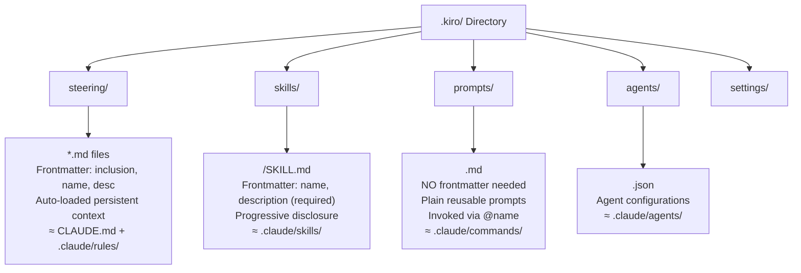

# Research: .kiro/prompts/ Format Specification & Claude Code Bridge

## Executive Summary

**`.kiro/prompts/` is NOT the same as `.kiro/skills/` or `.kiro/steering/`.** It's a separate concept — **reusable slash-command prompts** invocable via `@name` in Kiro CLI chat. Here's what I found:

1. **Prompts (`prompts/`)** = Simple markdown files, NO frontmatter required. Plain text reusable snippets invoked with `@name`. Equivalent to `.claude/commands/` in Claude Code.
2. **Skills (`skills/`)** = Folders with `SKILL.md` files that HAVE YAML frontmatter (`name`, `description`). Loaded via progressive disclosure. Equivalent to `.claude/skills/` in Claude Code.
3. **Steering (`steering/`)** = Markdown files with optional `inclusion:` frontmatter. Persistent context. Equivalent to `CLAUDE.md` / `.claude/rules/`.
4. **There IS an official bridge** — the AIM plugin system (`aim plugins install`) converts Kiro agents/skills to Claude Code plugins. Skills format is identical across both.

---

## 1. The .kiro/prompts/ Directory — Format & Schema

### What It Is

`.kiro/prompts/` stores **reusable prompt files** — plain markdown documents that act as slash-commands or `@`-mentionable references in Kiro CLI chat.

### Storage Locations & Priority

| Level | Location | Scope | Priority |
|-------|----------|-------|----------|
| **Local** (workspace) | `project/.kiro/prompts/` | Current project only | Highest |
| **Global** (user) | `~/.kiro/prompts/` | All projects | Medium |
| **MCP** | Provided by MCP servers | Server-configured | Lowest |

### File Format

**Prompts are plain markdown — NO YAML frontmatter required.**

```markdown
# My Reusable Prompt

## Process

1. Do this thing
2. Then do that thing
3. Produce output in this format
```

That's it. The filename (minus `.md`) becomes the prompt name.

### Invocation

- In Kiro CLI chat: `@prompt-name` 
- Via slash commands: `/prompts list`, `/prompts create`, `/prompts details`

### Key Behaviors

- Tab completion after `@`
- Known prompts take precedence over file paths with the same name
- Maximum 50 characters for prompt names
- File-based prompts (local/global) do NOT support arguments
- MCP prompts CAN accept arguments

### Comparison with Claude Code Commands

| Feature | Kiro CLI | Claude Code |
|---------|----------|-------------|
| Location | `.kiro/prompts/<name>.md` | `.claude/commands/<name>.md` |
| Invocation | `@name` | `/name` |
| Format | Plain markdown (no frontmatter) | Plain markdown (with optional frontmatter) |
| Arguments | Not supported for file-based | Supported via `$ARGUMENTS` |

---

## 2. Kiro Skills (.kiro/skills/) — The Frontmatter Format

### SKILL.md Frontmatter Schema (Official Zod Definition)

From the official Kiro IDE design spec (`AWS/Kiro/Design/SkillsSupport`):

```typescript
export const SkillFrontMatterSchema = z
  .object({
    name: z.string(),
    description: z.string(),
    license: z.string().optional(),
    compatibility: z.string().optional(),
    metadata: z.record(z.unknown()).optional(),
  })
  .passthrough(); // Ignore unrecognized fields for forward compatibility
```

### Practical YAML Frontmatter Example

```yaml
---
name: my-skill
description: What this skill does and when to use it.
version: 1.0.0
tags: [category, domain]
---
```

### Required vs Optional Fields

| Field | Required | Description |
|-------|----------|-------------|
| `name` | **Yes** | Skill identifier. Lowercase letters, numbers, hyphens. Max 64 chars. |
| `description` | **Yes** | When to activate. Max 1024 chars. Kiro matches against requests. |
| `license` | No | License information |
| `compatibility` | No | Compatibility info |
| `version` | No | Semver version (community convention, not enforced) |
| `tags` | No | Category tags (community convention) |
| `metadata` | No | Arbitrary key-value pairs |

### Skill Directory Structure

```
my-skill/
├── SKILL.md           # Required: frontmatter + instructions
├── references/        # Optional: supporting documentation
│   └── domain-context.md
├── scripts/           # Optional: executable code
│   └── helper.sh
└── assets/            # Optional: templates, resources
```

### Skill Locations

- User-level (global): `~/.kiro/skills/<name>/SKILL.md`
- Workspace-level: `<project>/.kiro/skills/<name>/SKILL.md`
- AIM packages: `~/.aim/packages/<PackageName>/skills/<name>/SKILL.md`

### Inclusion Modes for Skills

Skills support ONLY `auto` and `manual`:
- **auto**: Descriptions loaded at startup; full content loaded on-demand when the agent determines relevance
- **manual**: Appears in the `#` context picker; load explicitly

---

## 3. Kiro Steering (.kiro/steering/) — Frontmatter Schema

```typescript
export const SteeringContextFrontMatterSchema = z.object({
  inclusion: z.enum(['manual', 'auto']).optional().nullable(),
  name: z.string().optional(),
  description: z.string().optional(),
});
```

### Steering Inclusion Modes

| Mode | Behavior |
|------|----------|
| `always` (default) | Injected into every session |
| `auto` | Progressive disclosure — metadata at startup, full content on-demand |
| `manual` | Referenced via `#` in chat |
| `fileMatch` (conditional) | Triggered when matching files are opened |

### Example Steering File

```yaml
---
inclusion: always
---

# Java Coding Standards

All Java code must follow these conventions...
```

---

## 4. Official Way to Make .kiro/prompts Work in Claude Code

### The AIM Plugin System (Official Bridge)

The **AI Integration Manager (AIM)** is the official bridge. It translates Kiro agent packages into Claude Code plugins:

```bash
# Install as Kiro agent
aim agents install <package>

# Install as Claude Code plugin (separate command!)
aim plugins install <package>
```

**Translation is NOT automatic** — you must explicitly install for each tool.

### Translation Matrix (Kiro → Claude Code)

| Kiro CLI | Claude Code Plugin |
|----------|-------------------|
| `prompt` field in agent JSON | Markdown body in `agents/<name>.md` |
| Skills (via `--skill-paths`) | Files in `skills/` dir |
| MCP servers | `.mcp.json` shared at plugin level |
| Context files | `context/` directory |
| Agent SOPs | Via builder-mcp `--agent-sop-paths` |

### What's the Same Format

**Skills are identical across both tools:**
- Kiro: `.kiro/skills/<name>/SKILL.md`
- Claude Code: `.claude/skills/<name>/SKILL.md`

The SKILL.md format with YAML frontmatter (`name` + `description`) works in both without modification.

### What's Different

| Concept | Kiro Equivalent | Claude Code Equivalent |
|---------|----------------|----------------------|
| Prompts | `.kiro/prompts/<name>.md` | `.claude/commands/<name>.md` |
| Skills | `.kiro/skills/<name>/SKILL.md` | `.claude/skills/<name>/SKILL.md` |
| Steering | `.kiro/steering/*.md` | `CLAUDE.md` + `.claude/rules/*.md` |
| Agents | `.kiro/agents/<name>.json` | `.claude/agents/<name>.md` |

---

## 5. Community-Built Converters & Bridges

### kmux (AmznCmuxKiroTools)

Ships slash commands for **both** Claude Code (`~/.claude/commands/`) and Kiro (`~/.kiro/prompts/`). Acts as a practical bridge — same commands available in both tools.

### ADSGenAIToolkit

An installer that auto-detects which tools are installed and deploys to both:

```
| Tool           | Skills installed to              | Commands installed as                        |
|----------------|----------------------------------|----------------------------------------------|
| Kiro           | ~/.kiro/skills/<name>/SKILL.md   | ~/.kiro/prompts/<name>.md (frontmatter stripped) |
| Claude Code    | ~/.claude/skills/<name>/SKILL.md | ~/.claude/commands/<name>.md                  |
```

**Key detail**: When converting SKILL.md to a Kiro prompt, the YAML frontmatter is **stripped** (prompts don't use frontmatter).

### JarvisCLI Installer Pattern

A common community pattern for cross-tool deployment:
1. Copy SKILL.md → `~/.kiro/skills/<slug>/SKILL.md` (Kiro IDE auto-discovery)
2. Copy SKILL.md → `~/.claude/commands/<slug>/SKILL.md` (Claude Code)
3. Symlink `~/.kiro/prompts/<slug>.md` → `~/.kiro/skills/<slug>/SKILL.md` (kiro-cli prompts — YAML frontmatter is tolerated as plain text)

### builder-mcp-wrapper Pattern

```bash
#!/bin/bash
exec builder-mcp \
  --skill-paths "$HOME/.aim/skills/...,${PWD}/.kiro/skills" \
  --agent-sop-paths "$HOME/.aim/packages/.../agent-sops,$PWD/.kiro/prompts" \
  "$@"
```

This shows that `.kiro/prompts/` can also be passed as **agent-sop-paths** to builder-mcp, making them function like structured workflows.

---

## 6. Kiro CLI: prompts/ vs steering/ vs skills/ — Summary



### How Kiro CLI Processes Each Directory

| Directory | Processing | When Loaded | Format |
|-----------|-----------|-------------|--------|
| `steering/` | Parsed frontmatter, inclusion mode decides loading | Session start (always/auto) or on-demand (manual) | Markdown + YAML frontmatter |
| `skills/` | Frontmatter parsed for metadata; full content loaded on-demand | Metadata at session start; body when relevant | SKILL.md in subdirectory |
| `prompts/` | Read as plain text, available via `@name` | Listed on `/prompts list`; inserted when `@invoked` | Plain markdown |
| `agents/` | JSON agent configurations | When `--agent <name>` is used | JSON |

---

## 7. Key Takeaways

1. **`.kiro/prompts/*.md` files are plain markdown** — no frontmatter schema. The filename IS the prompt name.

2. **There is NO official `.kiro/prompts/` → Claude Code converter** because the format is trivially compatible. A `.kiro/prompts/foo.md` file maps directly to `.claude/commands/foo.md`. Copy the file.

3. **Skills ARE portable** between Kiro and Claude Code with zero modification (same SKILL.md + frontmatter format).

4. **The AIM plugin system** is the official "bridge" for complex agent packages, but for simple prompts/skills, it's just a file copy.

5. **Community tools** (ADSGenAIToolkit, JarvisCLI, kmux) handle cross-tool deployment by writing to both directories simultaneously, stripping frontmatter when converting skills→prompts.

---

## Sources

- [Kiro IDE vs Kiro CLI (GREFTech)](https://w.amazon.com/bin/view/FinanceAutomation/GREFTech/AICoding/tools/kiro-ide-vs-cli) — accessed 2026-06-18
- [Spec Design - Agent Skills in Kiro IDE](https://w.amazon.com/bin/view/AWS/Kiro/Design/SkillsSupport) — accessed 2026-06-18
- [Plugin behavior differences: Claude Code (AIM)](https://docs.hub.amazon.dev/aim/user-guide/concepts/plugins-claude-code) — accessed 2026-06-18
- [Claude Code for Kiro CLI Users](https://w.amazon.com/bin/view/AIOLabs/Guides/ClaudeCodeForKiroUsers) — accessed 2026-06-18
- [Kiro Steering (BuilderHub)](https://docs.hub.amazon.dev/docs/kiro/user-guide/howto-steering/) — accessed 2026-06-18
- [Using Skills with Kiro (ROCTech)](https://w.amazon.com/bin/view/ROCTechHome/GlobalHackathon2026/Resources/KiroIntroduction) — accessed 2026-06-18
- [Session 4: AIM Skills and Custom Agents](https://w.amazon.com/bin/view/Amazon_Payments/GenAI/KiroTraining/Session4Guide) — accessed 2026-06-18
- [Claude Code vs Kiro CLI](https://w.amazon.com/bin/view/Stores_Finance_Productivity/Tools/Claude_Code_vs_Kiro_CLI) — accessed 2026-06-18
- [Kiro CLI Prompts Management (kiro.dev cache)](https://code.amazon.com/packages/AB-SSR-Finance-workspace/blobs/mainline/--/.kiro/skills/workspace-designer/.kiro-cli-docs-cache/chat--manage-prompts.md) — accessed 2026-06-18
- [ADSGenAIToolkit README](https://code.amazon.com/packages/ADSGenAIToolkit) — accessed 2026-06-18
- [AmznCmuxKiroTools (kmux)](https://code.amazon.com/packages/AmznCmuxKiroTools) — accessed 2026-06-18
- [JarvisCLI DESIGN.md](https://code.amazon.com/packages/JarvisCLI) — accessed 2026-06-18
- [AGIAgentCLI KIRO_QUICK_REFERENCE.md](https://code.amazon.com/packages/AGIAgentCLI) — accessed 2026-06-18
- ⚠️ External link — [kiro.dev/docs/steering/](https://kiro.dev/docs/steering/) — referenced 2026-06-18
- ⚠️ External link — [agentskills.io](https://agentskills.io) — referenced 2026-06-18
