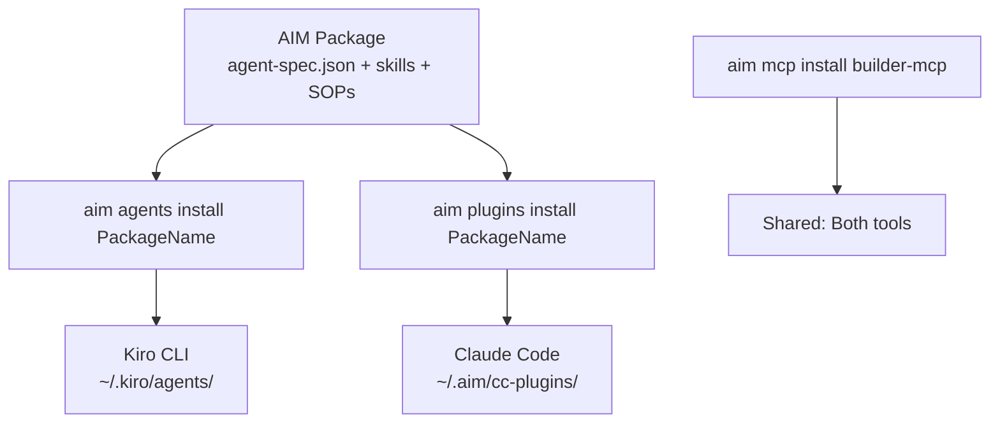

# Claude Code & Kiro CLI Interchangeability at Amazon

## Executive Summary

Claude Code and Kiro CLI are **both AIM-compatible** but use **different configuration formats**. They share the same underlying infrastructure (Builder MCP, AIM packages, Bedrock) but require parallel installation paths. AIM agents built for Kiro must be **reinstalled as plugins** for Claude Code via `aim plugins install`. The key shared layer is **AIM packages** — author once, install differently per tool.

### Key Findings

| Question | Answer |
|----------|--------|
| Does Claude Code support MCP? | ✅ Yes — Builder MCP is preconfigured out of the box |
| Can `.agent-spec.json` be used with Claude Code? | ⚠️ Not directly — must reinstall as plugins via `aim plugins install` |
| What's the equivalent of `AGENTS.md`? | `CLAUDE.md` (project root or `~/.claude/CLAUDE.md` globally) |
| Shared config approaches? | ✅ AIM packages are the shared source; MCP servers are shared via `aim mcp install` |

---

## 1. Claude Code MCP Server Support

### Builder MCP — Preconfigured

The Amazon internal distribution of Claude Code comes with **Builder MCP preconfigured**. No manual setup required.

```bash
# Verify Builder MCP is connected in a Claude Code session:
/mcp
# Should show: builder-mcp · ✔ connected
```

### What Builder MCP Provides

- **Code search** — Same backend as Code Browser
- **Code reviews** — Create, view, manage CRs
- **Ticketing** — Create/update SIM tickets, search issues
- **Internal search** — Search wikis, BuilderHub, Sage
- **Internal websites** — Read w.amazon.com, quip-amazon.com, etc.
- **Brazil workspace management**
- **Build failure analysis**

### MCP Installation Methods

```bash
# Method 1: Automatic with AIM plugin install
aim plugins install PackageName
# MCP servers from agent dependencies are auto-installed

# Method 2: Manual standalone MCP install
aim mcp install builder-mcp
# Writes to ~/.claude.json for Claude Code

# Method 3: In ~/.claude/settings.json (permissions)
```

### MCP Configuration Locations

| Tool | Global MCP Config Location |
|------|---------------------------|
| Kiro CLI | `~/.kiro/settings/mcp.json` |
| Claude Code | `~/.claude.json` (user MCPs) |
| Amazon Q Developer | `~/.aws/amazonq/mcp.json` |

---

## 2. AIM Agent Specs (`.agent-spec.json`) and Claude Code

### Critical Difference

> **Agents installed via `aim agents install` (for Kiro) are NOT automatically available in Claude Code. You must reinstall them as plugins with `aim plugins install`.**

### Translation Matrix

| Capability | Kiro CLI (agents) | Claude Code (plugins) |
|-----------|------------------|----------------------|
| System prompt | `prompt` field in agent JSON | Markdown body in `agents/<name>.md` |
| Model selection | `model` field | `model:` in frontmatter |
| Description | `description` field | `description:` in frontmatter |
| Skills | Via builder-mcp `--skill-paths` | Files in `skills/` dir |
| MCP servers | `mcpServers` per agent in JSON | `.mcp.json` shared at plugin level |
| Context files | `resources` array with `file://` URIs | Copied to `context/` |
| Agent SOPs | Via builder-mcp `--agent-sop-paths` | Via builder-mcp in `.mcp.json` |
| Tool filtering | `tools` object | `tools:` in frontmatter |
| Hooks | `hooks` object | Plugin-level hooks only (agent-level stripped) |
| Permission mode | Configurable per agent | **Not supported** (stripped) |

### What Does NOT Transfer

- **Agent-level hooks** — stripped with warning; use plugin-level hooks instead
- **Permission mode** — stripped with warning
- **Per-agent MCP servers** — promoted to plugin-level `.mcp.json` (shared across all agents)

### AIM Agent Spec Schema (for reference)

```json
{
  "schemaVersion": "1",
  "name": "my-agent",
  "config": {
    "description": "Agent for development tasks",
    "systemPrompt": "You are an expert developer...",
    "model": "claude-opus-4.6"
  },
  "dependencies": {
    "mcpRegistry": {
      "builder-mcp": {
        "args": ["--include-tools", "InternalSearch,InternalCodeSearch"]
      }
    },
    "skills": { "skillNames": ["*"] },
    "agentSops": { "agentSopNames": ["*"] },
    "context": { "contextNames": ["*"] }
  },
  "clientConfig": {
    "kiroCli": {
      "tools": ["@builtin", "@builder-mcp"],
      "allowedTools": ["fs_read", "@builder-mcp/InternalCodeSearch"]
    }
  }
}
```

---

## 3. CLAUDE.md vs AGENTS.md

### Claude Code uses `CLAUDE.md`, NOT `AGENTS.md`

> Claude Code reads `CLAUDE.md`, not `AGENTS.md`. If your repository has an existing `AGENTS.md`, you need to import it into `CLAUDE.md`.

### Configuration Hierarchy

```
~/.claude/CLAUDE.md          # Global context (all projects)
~/.claude/settings.json      # Global settings, model, permissions
~/.claude/rules/*.md         # Global steering rules
<project>/CLAUDE.md          # Project-level context
<project>/.claude/rules/     # Project-level rules
```

### Kiro CLI Configuration Hierarchy

```
~/.kiro/settings/mcp.json         # Global MCP servers
~/.kiro/agents/<name>.json        # Installed agent configs
~/.config/aim/current/skills/     # AIM-installed skills
<project>/AGENTS.md               # Project-level context (auto-loaded by some agents)
<project>/.kiro/                   # Project-level Kiro config
```

### AGENTS.md Workaround for Kiro

Some AIM agents (like `gpu-dev` from `AIPowerUserCapabilities`) auto-discover `AGENTS.md` in the working directory. This is agent-specific, not a universal Kiro feature.

---

## 4. Shared Configuration Approaches

### The Shared Layer: AIM Packages

The key insight is that **AIM packages are the single source of truth**. Author once, install to both:



### Shared MCP Servers

MCP servers installed via `aim mcp install` are shared:

```bash
# Install builder-mcp (works for both Kiro and Claude Code)
aim mcp install builder-mcp

# For Claude Code specifically, this writes to ~/.claude.json
# For Kiro, this writes to ~/.kiro/settings/mcp.json
```

### Dual-Tool Setup Script

```bash
#!/bin/bash
# Install AIM package for both Kiro and Claude Code

PACKAGE="YourTeamAgents"

# For Kiro CLI
aim agents install "$PACKAGE"

# For Claude Code (as plugin)
aim plugins install "$PACKAGE"

# Shared MCP server
aim mcp install builder-mcp
```

### Symlink Skills (Manual Approach for Claude Code)

From the wiki setup guides, you can symlink AIM skills into Claude Code's skills directory:

```bash
# Import AIM skills into Claude Code
for skill in ~/.config/aim/current/skills/*/; do
    name=$(basename "$skill")
    ln -sf "$skill" ~/.claude/skills/${name}
done
```

### Settings.json for Claude Code (Amazon Setup)

```json
{
  "$schema": "https://json.schemastore.org/claude-code-settings.json",
  "env": {
    "CLAUDE_CODE_DISABLE_NONESSENTIAL_TRAFFIC": "1",
    "CLAUDE_CODE_HIDE_ACCOUNT_INFO": "1",
    "CLAUDE_CODE_USE_BEDROCK": "1"
  },
  "model": "global.anthropic.claude-opus-4-6-v1",
  "permissions": {
    "allow": [
      "mcp__builder-mcp__ReadRemoteTestRun",
      "mcp__builder-mcp__InternalCodeSearch",
      "mcp__builder-mcp__ReadInternalWebsites"
    ]
  }
}
```

### Launching with a Specific Agent

```bash
# Kiro CLI
kiro-cli chat --agent my-agent

# Claude Code (loads agent config into main agent)
claude --agent my-agent
```

**Important behavioral difference:** In Kiro, `--agent` replaces the entire configuration. In Claude Code, `--agent` loads a subagent definition into the main agent — the session can still spawn other subagents. To get Kiro-like isolation in Claude Code, omit `Agent` from the loaded agent's `tools` list.

---

## 5. Practical Recommendations

### For Users with Existing Kiro AIM Agents

1. **Keep your AIM package as-is** — it's the shared source
2. **Install to both tools:**
   ```bash
   aim agents install YourPackage    # For Kiro
   aim plugins install YourPackage   # For Claude Code
   ```
3. **Use CLAUDE.md for Claude Code context** — port your AGENTS.md content
4. **Share Builder MCP** — `aim mcp install builder-mcp` works for both

### For New Agent Development

1. **Author in AIM format** (`.agent-spec.json`) — this is the portable format
2. **Test with both tools** — behavioral differences exist (hooks, permissions)
3. **Use plugin namespaces** in `aim.json` if you need different subsets for different audiences
4. **Consider standalone agents** (experimental) if you need per-agent hooks/permissions in Claude Code

### Configuration Files to Maintain

| File | Purpose | Tool |
|------|---------|------|
| `~/.claude/settings.json` | Model, permissions, env vars | Claude Code |
| `~/.claude/CLAUDE.md` | Global context | Claude Code |
| `~/.kiro/settings/mcp.json` | Global MCP servers | Kiro CLI |
| `agents/<name>.agent-spec.json` | Agent definitions (in AIM package) | Both (via AIM) |
| `skills/` | Shared skills directory | Both (via AIM) |

---

## 6. Key Differences Summary

| Aspect | Kiro CLI | Claude Code |
|--------|----------|-------------|
| Install command | `aim agents install` | `aim plugins install` |
| Config location | `~/.kiro/agents/` | `~/.aim/cc-plugins/` or `~/.claude/agents/` |
| Context file | `AGENTS.md` (agent-specific) | `CLAUDE.md` |
| Agent format | JSON (`.json`) | Markdown with YAML frontmatter (`.md`) |
| MCP scope | Per-agent | Per-plugin (shared) |
| Hooks | Agent-level supported | Plugin-level only |
| Subagent model | Single agent per session | Main agent + multiple subagents |
| Auto-delegation | N/A | Based on description field matching |

---

## Sources

- [Using Claude Code - BuilderHub](https://docs.hub.amazon.dev/claude-code/user-guide/howto) — accessed 2026-06-17
- [Claude Code - BuilderHub](https://docs.hub.amazon.dev/claude-code) — accessed 2026-06-17
- [Claude Code Concepts](https://docs.hub.amazon.dev/claude-code/user-guide/concepts) — accessed 2026-06-17
- [Plugin behavior differences: Claude Code](https://docs.hub.amazon.dev/aim/user-guide/concepts/plugins-claude-code) — accessed 2026-06-17
- [Plugins - AIM User Guide](https://docs.hub.amazon.dev/aim/user-guide/concepts/plugins) — accessed 2026-06-17
- [Agents - AIM User Guide](https://docs.hub.amazon.dev/aim/user-guide/concepts/agents) — accessed 2026-06-17
- [MCP Servers - AIM User Guide](https://docs.hub.amazon.dev/aim/user-guide/concepts/mcp-servers) — accessed 2026-06-17
- [Agent Composition - AIM User Guide](https://docs.hub.amazon.dev/aim/user-guide/concepts/agent-composition) — accessed 2026-06-17
- [Builder MCP - BuilderHub](https://docs.hub.amazon.dev/builder-mcp) — accessed 2026-06-17
- [Installing Claude Code](https://docs.hub.amazon.dev/claude-code/user-guide/getting-started-cli) — accessed 2026-06-17
- [Claude Code Setup - Wiki](https://w.amazon.com/bin/view/AWS/CloudEndure/Cirrus/ClaudeCode) — accessed 2026-06-17
- [Amazon Quick Desktop Setup](https://w.amazon.com/bin/view/TNC/AmazonQuickDesktopSetup) — accessed 2026-06-17
- [Kiro Files: The Agent Context Cookbook](https://w.amazon.com/bin/view/IntechLatam/TechDojo/blog/kiro-context-cookbook) — accessed 2026-06-17
- [Sage: kiro-cli unable to locate agent SOPs](https://sage.amazon.dev/posts/2039949) — accessed 2026-06-17
